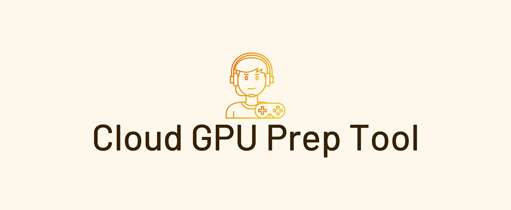

# Cloud GPU Prep Tool

This script sets your AWS Cloud GPU instance (Windows Server 2019/2022) with NVIDIA, sound and other drivers, installs tools and bunch of settings to make your life easier. 

**This tool is based on [Parsec Cloud Prep Tool](https://github.com/parsec-cloud/Parsec-Cloud-Preparation-Tool) but only for AWS and fixes bugs, and settings.**

> It's provided as is with no warranty, or gurantee if it fails, so use it at your own risk. Cloud billing is your responbility do not rely on this tool.

<div style="text-align: center;">
    
</div>

### Instructions:     

1. Set up your GPU accelerated cloud Windows Server machine on Amazon AWS. 
2. AWS: Log in via RDP and make note of the password (decrypt using keypair file generated at first launch i.e. .pem file) - you'll need it later
3. Open Powershell on the cloud machine.
4. Copy the below code and follow the instructions in the script - you'll see them in RED

### START HERE! Copy this code into Powershell (you may need to press enter at the end):
```
[Net.ServicePointManager]::SecurityProtocol = "tls12, tls11, tls" 
$ScriptWebArchive = "https://github.com/hurshd0/Cloud-GPU-Prep-Tool/archive/master.zip"  
$LocalArchivePath = "$ENV:UserProfile\Downloads\Cloud-Preparation-Tool"  
(New-Object System.Net.WebClient).DownloadFile($ScriptWebArchive, "$LocalArchivePath.zip")  
Expand-Archive "$LocalArchivePath.zip" -DestinationPath $LocalArchivePath -Force  
CD $LocalArchivePath\Cloud-Preparation-Tool-master\ | powershell.exe .\Loader.ps1  
```
This tool supports:

### OS:
```
Server 2022 Base AMI
Server 2019 Base AMI
```
                    
### CLOUD GPU INSTANCES (FROM HIGH TO LOW COST):
```
4 core / 16 GB RAM
AWS g5.xlarge              (Ampere A10G)                        $1.19/hr
AWS g4dn.xLarge            (Tesla T4 with vGaming driver)       $0.71/hr
AWS g4ad.xlarge            (AMD Radeon Pro V520)                $0.56/hr

8 core / 32 GB RAM
AWS g5.2xlarge              (Ampere A10G)                       $1.58/hr
AWS g4dn.2xLarge            (Tesla T4 with vGaming driver)      $1.12/hr
AWS g4ad.2xlarge           (AMD Radeon Pro V520)                $0.9/hr
```


### RDP:  
Only use RDP to intially setup the instance. Parsec and RDP are not friendly with each other.  


### Creating AMI:
TBD


### Issues:
TBD